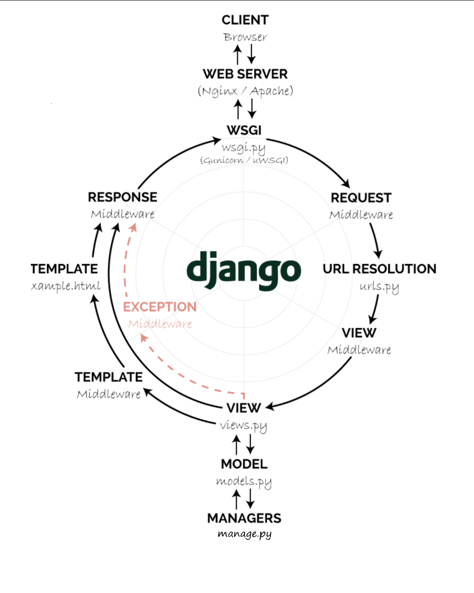
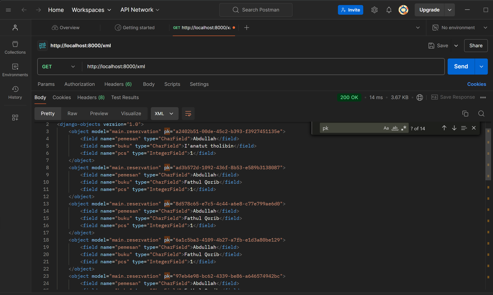
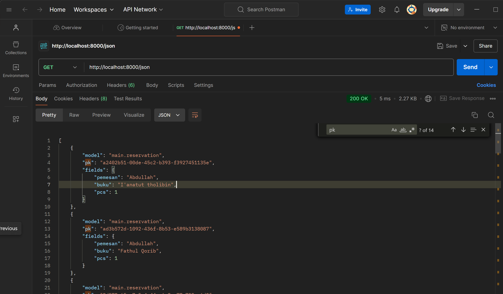
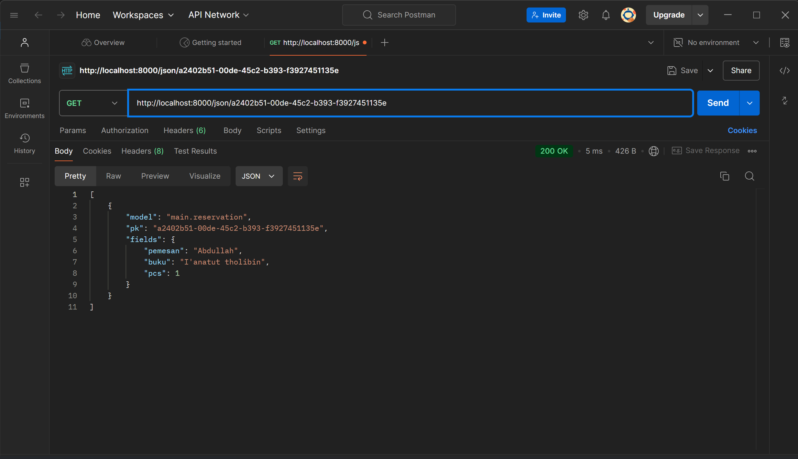

# MANHAJ BOOKS (كتب المنهج)

## Proyek E-Commerce - Tugas 2 PBP

# Tugas Individu 2
## 1.)Jelaskan bagaimana cara kamu mengimplementasikan checklist di atas secara step-by-step 
### 1. Membuat Proyek Baru
* **Membuat folder baru bernama manhaj-books**
* **Menginisialisasi Git didalam manhaj-books**
* **membuat repository baru di Github dengan nama manhaj-books**
* **Membuka folder manhaj-books dengan VScode**
* **Membuat env python(dengan command: python -m venv env)**
* **Mengaktifkan env(dengan command: env\Scripts\activate)**
* **Membuat txt file bernama requirements.txt**
* **menginstall segala yang terdapat pada requirements.txt**
* **Membuat proyek Django manhaj_books yang menjadi sebuah folder**
* **mengedir ALLOWED_HOSTS**
* **Membuat .gitignore melalui VScode**
* **melakukan add, commit, push pada github**

### 2. Membuat aplikasi main pada proyek

* **Melakukan startapp main untuk membuat aplikasi dengan arsitektur django bernama main**

### 3. Melakukan routing pada proyek agar dapat menjalankan aplikasi main

* **Memasukkan main pada settings.py tepatnya pada INSTALLED_APPS**

### 4. Membuat models

* **Membuat folder baru bernama templates**
* **membuat file templates\main.html dan mulai berkarya dengan visual**
* **Membuat class Product pada models.py yang berisi atribut nama, price, description**

### 5. Membuat Function pada views.py

* **Memberi nama function show_main dengan parameter request**
* **Membuat List of Dictionary didalam function dengan nama products yang berisi nama, harga, dan deskripsi barang**
* **Membuat Dictionary bernama context untuk menyimpan beberapa variabel untuk  dipakai pada html**

### 6. Membuat sebuah routing pada urls.py aplikasi main

* **Mengisi urlpatterns dengan nama function yang terdapat pada views.py**

### 7. Melakukan deployment ke PWS

* **add remote PWS**
* **Check the branch, use master branch**
* **lalu push ke PWS dan masukkan username dan password**

### 8. Membuat README.md file ini

## 2.) bagan yang berisi request client ke web aplikasi berbasis Django

## 3.) Jelaskan fungsi git dalam pengembangan perangkat lunak!

* **Bisa menjadi pelacak perubahan kode sehingga ketika berkolaborasi dengan tim masing-masing dari mereka dapat melacak perubahan kode, dan juga membuat perangkat lunak seakan-akan memiliki versi-versi pada setiap commitnya**
## 4.) Mengapa Memilih Django sebagai Framework Pembelajaran?

Django merupakan pilihan yang populer untuk memulai pembelajaran pengembangan web karena beberapa alasan berikut:

* **Konvensi lebih baik daripada konfigurasi:** Django menyediakan struktur yang jelas dan konsisten, sehingga pengembang dapat fokus pada logika bisnis.
* **Komunitas yang besar:** Django memiliki komunitas pengguna yang sangat aktif, sehingga mudah menemukan dokumentasi, tutorial, dan bantuan jika diperlukan.
* **Fitur lengkap:** Django menyediakan berbagai fitur bawaan, seperti ORM, form handling, dan admin interface, yang sangat berguna untuk membangun aplikasi web yang kompleks.
* **Python:** Django menggunakan bahasa pemrograman Python yang dikenal mudah dipelajari dan memiliki sintaks yang bersih.

## 5.) Mengapa model pada Django disebut sebagai ORM?

### Sesuai dengan namanya yaitu ORM(--Object-Relational Mapper--)
* **Object :** Model-model dalam Django adalah objek Python. Mereka memiliki atribut (fields) yang merepresentasikan kolom dalam tabel database, dan metode-metode untuk melakukan operasi pada data.
* **Relational :** Database relasional menggunakan tabel untuk menyimpan data, dengan hubungan antar tabel (relasi). ORM Django memetakan hubungan-hubungan ini menjadi hubungan antara model-model Python.
* **Mapper** ORM bertindak sebagai "pemeta" yang menerjemahkan antara representasi objek dalam Python dan representasi relasional dalam database.

Dinamai ORM sebab ORM memungkinkan kita berinteraksi dengan database menggunakan sintaks Python yang lebih intuitif, tanpa harus menulis query SQL secara langsung. Kita bisa membuat, membaca, memperbarui, dan menghapus data dalam database seolah-olah kita sedang berinteraksi dengan objek Python.

# Tugas Individu 3
## 1.) Jelaskan mengapa kita memerlukan data delivery dalam pengimplementasian sebuah platform?
### Karena ketika kita tidak menggunakan data delivery maka akan terjadi penulisan secara manual terus menerus dan hal tersebut akan mempersulit developer dalam mengolah data secara efisien, akurat, dan aman tentunya.
## 2.) Menurutmu, mana yang lebih baik antara XML dan JSON? Mengapa JSON lebih populer dibandingkan XML?
### JSON lebih populer karena memiliki sintaks yang lebih ringkas dan mudah dibaca, serta lebih mudah diproses oleh mesin, sedangkan XML lebih cocok untuk struktur data yang kompleks, validasi data, dan metadata.
## 3.) Jelaskan fungsi dari method is_valid() pada form Django dan mengapa kita membutuhkan method tersebut?
### fungsinya adalah untuk memastikan bahwa data yang diterima dari pengguna adalah data yang bersih dan aman. Kita membutuhkannya karena untuk berjaga-jaga jika terdapat data yang tidak bersih ataupun bahaya.
## 4.) Mengapa kita membutuhkan csrf_token saat membuat form di Django? Apa yang dapat terjadi jika kita tidak menambahkan csrf_token pada form Django? Bagaimana hal tersebut dapat dimanfaatkan oleh penyerang? 
### Sesuai namanya CSRF token diperlukan saat membuat form di Django untuk mencegah serangan Cross-Site Request Forgery (CSRF), jika tidak menambahkannya maka aplikasi rentan terhadap serangan CSRF, di mana penyerang dapat memanipulasi pengguna untuk mengirim permintaan berbahaya.
## 5.) Jelaskan bagaimana cara kamu mengimplementasikan checklist di atas secara step-by-step (bukan hanya sekadar mengikuti tutorial).
### 
- Memberikan tombol input pada laman main(show_main)
- menampilkan daftar buku pada laman reservation
- lalu meletakkan form dibawah tabel list buku-buku berserta harganya
- menambahkan 4 fungsi baru yaitu view XML, JSON, XML by ID, dan JSON by ID.
- melakukan routing untuk 4 fungsi baru XML, JSON, XML by ID, dan JSON by ID pada urls.py
- Menjawab pertanyaan yang ada pada tugas individu 2 ini
# show_xml

# show_json

# show_xml_by_id

# show_json_by_id

